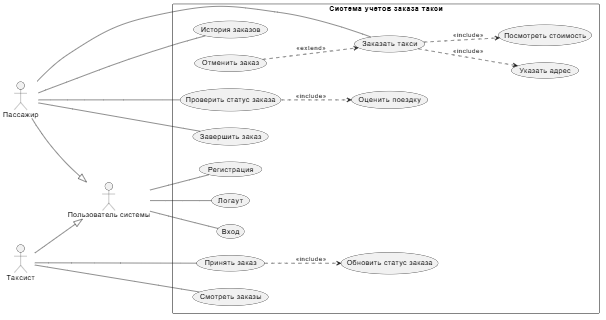

## Описание проекта

### Задача
Делаем монолитное десктопное приложение для учёта заказов такси. В системе две роли — пассажир (клиент) и таксист. Пассажир регистрируется, входит в систему, заказывает такси (указывает адрес подачи и адрес назначения), видит рассчитанную стоимость поездки, следит за статусом заказа (создан → принят → в пути → завершён → отменён) и может посмотреть историю своих поездок. Таксист видит список доступных заказов, берёт их в работу и меняет статус по мере выполнения. 

### Архитектура и технологии 
Архитектура — монолит, слоистая. Разбиваем код на три слоя: слой представления (GUI на Qt/GTK), слой бизнес-логики (сервисы — расчёт стоимости, смена статусов, проверки) и слой доступа к данным (репозитории — CRUD-запросы к PostgreSQL). Всё пишем на C++ и C, БД — PostgreSQL, интерфейс — Qt/GTK (окна регистрации/входа, главное окно пассажира, главное окно таксиста, форма заказа, окно истории). Рабочая система, где один пользователь заказывает, другой выполняет, а данные честно лежат в базе. 

Ссылка на блоксхемы в Miro:

https://miro.com/app/board/uXjVHmRJKpU=/

Фото Use Case

